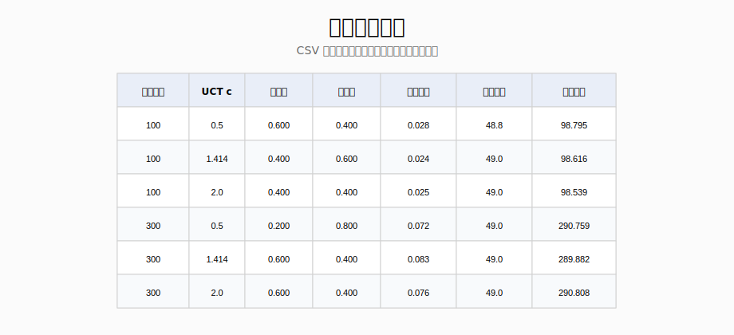
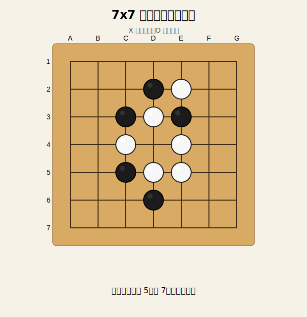
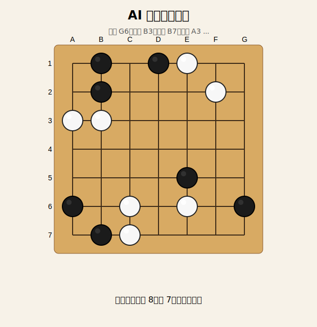
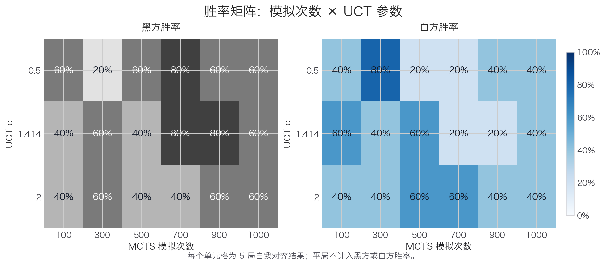
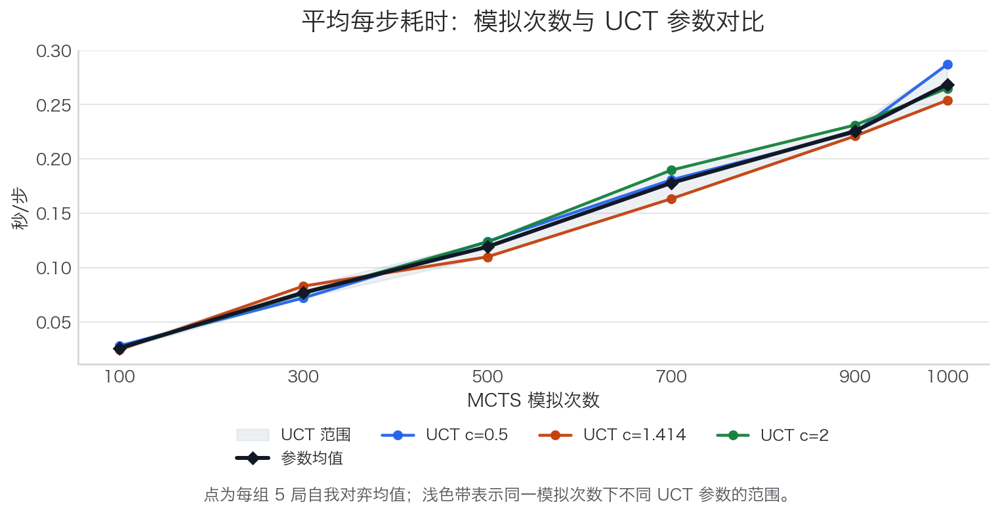
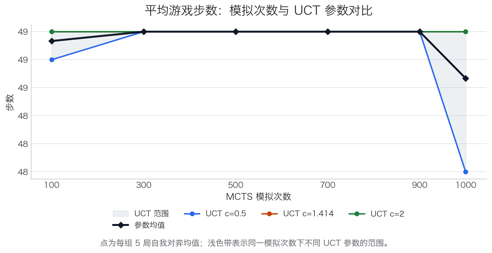
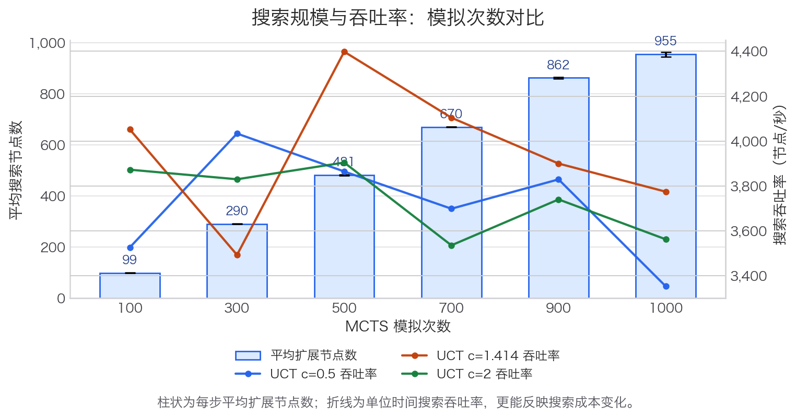

\newpage

# 基于蒙特卡洛树搜索的 7x7 围棋决策程序

## 一、实验目的

本实验实现一个基于蒙特卡洛树搜索（Monte Carlo Tree Search, MCTS）的 7x7 围棋决策程序。围棋可以被看作一个规模很大的状态转移图：每一个合法棋盘局面是图中的顶点，每一个合法落子或 pass 是有向边，终局计分则给出从状态图到胜负结果的映射。在完整围棋中，这个图的规模极大；本实验将棋盘固定为 7x7，以便在课程实验规模内完整实现规则、搜索和评估流程。

本实验的主要目标包括：第一，将围棋基本规则转化为可执行的状态转移程序；第二，实现 MCTS 的 Selection、Expansion、Simulation 和 Backpropagation 四个阶段；第三，通过自我对弈比较不同模拟次数和 UCT 参数对胜率、耗时、步数和搜索规模的影响；第四，形成可复现实验流程，自动生成 CSV 数据、截图、评价图表以及最终课程报告。

## 三、算法原理

MCTS 的基本思想是在当前局面对应的搜索树上进行多次采样，用有限次数的随机模拟近似估计每个候选走法的价值。搜索树中的根节点表示当前局面，边表示一次落子，子节点表示落子后的新局面。由于围棋博弈树分支很多，直接穷举不可行，因此 MCTS 使用“逐步扩展 + 随机模拟”的方式，把计算量集中在更有希望的分支上。

一次完整搜索包括四个阶段：

1. Selection：从根节点开始，根据 UCT 公式选择子节点。
2. Expansion：当节点存在未访问合法走法时，扩展一个新节点。
3. Simulation：从新节点局面开始随机模拟，直到终局或达到模拟上限后进行计分。
4. Backpropagation：将模拟胜负结果沿搜索路径回传，更新访问次数和胜场。

本程序采用如下 UCT 公式：

$$
UCT = \frac{wins}{visits} + c \sqrt{\frac{\log(parent\_visits)}{visits}}
$$

其中 `c` 为探索参数，默认值为 1.414。`c` 较小时更偏向已知较优分支，`c` 较大时会增加对低访问分支的探索。

从图论角度看，MCTS 并不显式构造完整状态图，而是在状态图上按需生成一棵局部搜索树。UCT 公式中的第一项代表 exploitation，即利用当前统计上胜率较高的分支；第二项代表 exploration，即鼓励访问次数较少但仍有潜力的分支。二者平衡后，算法能够在有限时间内给出较合理的近似决策。

## 四、规则简化说明

本实验只支持 7x7 棋盘。规则实现包括黑白轮流落子、提子、禁止自杀、简单劫、允许 pass、双方连续 pass 后终局。计分采用简化中国规则，即棋盘上已有棋子数加被单方包围的空点数作为该方面积分。

规则简化主要有三点。第一，不加入贴目，因此黑白胜负完全由面积计分决定。第二，劫规则采用简单劫：如果一次落子使棋盘立即回到上一手之前的局面，则判为非法；程序不实现完整 superko。第三，为避免随机模拟和反复提子导致对局过长，程序设置 49 步安全上限，达到上限后按当前局面计分。该上限不会改变基本规则演示目的，但能保证批量实验可在合理时间内完成。

## 五、程序设计

`go_game.py` 定义不可变局面对象 `GoGame`，棋盘使用元组结构保存，便于 MCTS 复制和回溯。每次落子会检查棋点是否为空、是否造成提子、己方棋块是否仍有气，以及是否违反简单劫规则。提子判断通过广度优先搜索得到棋块和气，若对方棋块气数为零，则从棋盘上移除。

`mcts.py` 定义 `MCTSNode` 和 `MCTS`。节点记录父节点、落子、子节点、未扩展走法、访问次数和胜场。搜索采用懒加载方式生成未扩展走法，避免在每个新节点上立即枚举所有合法走法，从而减少批量实验中的重复规则检查。搜索结果使用访问次数最多的根子节点作为最终决策。

`main.py` 提供命令行交互。默认模式为人机对战，用户执黑；`--mode selfplay` 可运行 AI 自我对弈；`--simulations` 可修改每步模拟次数；`--uct` 可修改 UCT 探索参数。实验脚本使用多进程并行执行不同参数组合，以保证 90 局自我对弈能够在可接受时间内完成。

## 六、实验设置

实验固定棋盘为 7x7。对比模拟次数为 100、300、500、700、900、1000，对比 UCT 参数为 0.5、1.414、2.0。每组参数进行 5 局 AI 自我对弈，记录黑方胜率、白方胜率、平均每步耗时、平均游戏步数和平均搜索节点数。实验结果保存到 `results/experiment_results.csv`。

| 参数       | 取值                                 |
| :--------- | :----------------------------------- |
| 棋盘大小   | 7x7                                  |
| 模拟次数   | 100, 300, 500, 700, 900, 1000        |
| UCT 参数   | 0.5, 1.414, 2.0                      |
| 每组对局数 | 5                                    |
| 总对局数   | 90                                   |
| 评价指标   | 胜率、每步耗时、游戏步数、搜索节点数 |

\newpage

## 七、实验结果与分析

实验数据由 `experiment.py` 自动生成。每个参数组合进行 5 局自我对弈，因此单个组合的胜率粒度为 20%。由于围棋随机模拟本身存在方差，胜率结果不应被解释为严格棋力排名，而更适合作为搜索参数对决策倾向的观察。

总体上，模拟次数增加会带来更大的搜索树和更高的计算成本。UCT 参数较小时，搜索更集中于早期表现好的分支；UCT 参数较大时，搜索覆盖范围更广，但在固定模拟次数下也可能降低对优势分支的利用强度。实验结果截图展示了 CSV 中的主要指标。

{width=86%}

\newpage

## 八、程序运行截图

下图展示了 7x7 棋盘的 SVG 显示效果。

{width=66%}

\newpage

下图展示了 AI 自我对弈过程中的一个局面。

{width=66%}

\newpage

## 九、评价图表分析

胜率图用于观察不同模拟次数下黑白双方胜率变化。图中使用矩阵而不是简单折线，是因为实验同时比较了模拟次数和 UCT 参数两个变量。每个单元格对应一个参数组合，颜色和文字共同表示胜率。由于 7x7 棋盘规模较小且每组只进行 5 局，自我对弈胜率可能存在随机波动，因此更适合观察趋势而不是得出绝对强弱结论。

{width=92%}

平均耗时图体现搜索成本。模拟次数从 100 增加到 1000 后，每步耗时通常近似增长。UCT 参数会影响搜索树访问路径，但主要成本仍由模拟次数决定，因此耗时曲线整体呈上升趋势。

{width=92%}

平均步数图反映不同搜索参数对对局长度的影响。如果 AI 更倾向于稳健落子而不是过早 pass，平均步数会增加。本实验设置 49 步安全上限，因此步数接近 49 表示对局通常没有通过连续 pass 很早结束。

{width=92%}

平均搜索节点数图用于验证 MCTS 搜索规模。由于一次模拟通常会扩展一个新节点，节点数会与模拟次数高度相关；因此图中同时加入搜索吞吐率，用于观察单位时间内的搜索效率变化。这样比单纯画节点数折线更有信息量，因为它同时展示了搜索规模和运行效率。

{width=92%}

\newpage

## 十、不足与改进

本程序为了突出 MCTS 主流程，对围棋规则进行了简化，没有加入贴目、完整 superko、复杂死活判断和高级 rollout 策略。随机 rollout 虽然实现简单，但会产生较大方差，也难以准确判断局部死活。

后续可从三方面改进。第一，在 rollout 中加入局部启发式，例如优先提子、避免填自己眼位、优先占据边角关键点。第二，引入 RAVE 或先验评分，使搜索初期能更快区分候选走法。第三，使用并行 MCTS 或轻量神经网络评估函数，提高高模拟次数下的搜索效率和决策质量。

## 十一、结论

本实验完成了一个可运行、可复现的 7x7 围棋 MCTS 决策程序。程序从规则层、搜索层、实验层和报告生成层形成了完整闭环：规则层能够处理轮流落子、提子、禁自杀、简单劫、pass 和面积计分；搜索层实现了 UCT 选择、节点扩展、随机模拟和结果回传；实验层能够批量比较不同模拟次数和 UCT 参数；报告层能够自动生成截图、图表、CSV 结果以及 PDF 文档。

从规则建模角度看，围棋局面可以自然表示为状态图中的顶点，合法落子可以看作状态之间的有向边。即使棋盘缩小到 7x7，完整状态图仍然不适合显式枚举，因此按需生成局部搜索树是一种合理策略。MCTS 的优势正体现在这一点：它不需要预先展开完整博弈树，而是在当前局面附近反复采样，通过访问次数和胜率统计逐步逼近较优走法。

从实验结果看，模拟次数是影响运行成本的主要因素。随着模拟次数从 100 增加到 1000，平均搜索节点数和平均每步耗时明显上升，说明搜索规模与计算开销基本同步增长。UCT 参数则主要影响探索与利用的平衡：较小的 UCT 参数更容易集中搜索当前胜率较高的分支，较大的 UCT 参数会增加对低访问分支的探索。在小样本自我对弈中，胜率存在随机波动，因此实验更适合说明参数对搜索行为的影响，而不是给出绝对棋力排名。

总体而言，本实验说明了 MCTS 在离散博弈图上的实用价值。它通过局部扩展、随机采样和统计回传，将一个难以穷举的博弈问题转化为可控计算预算下的近似决策问题。这与现代图论中面对大规模状态空间时常用的局部搜索、采样估计和近似推断思想是一致的。后续如果加入更强的 rollout 策略、并行搜索或学习型评估函数，程序可以在保持规则框架不变的基础上进一步提升决策质量。
