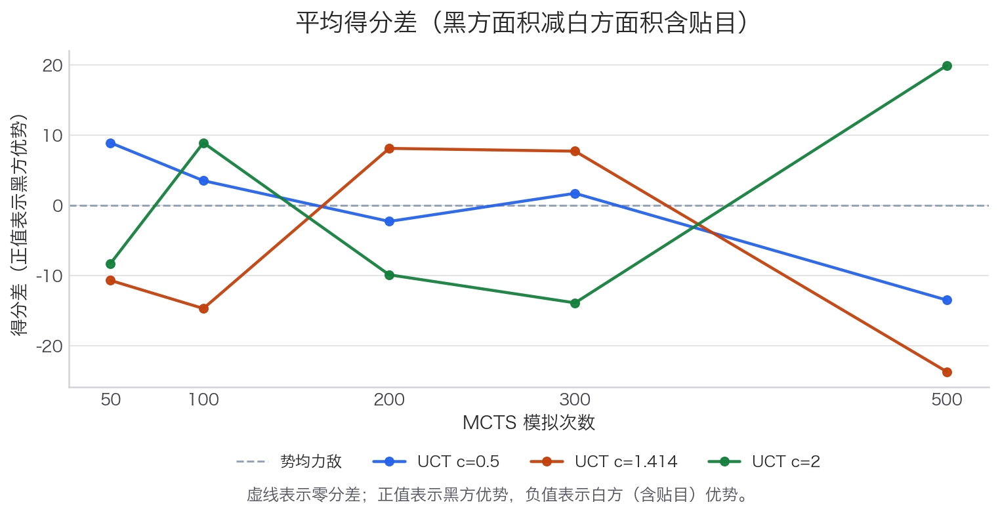

\newpage

# 基于蒙特卡洛树搜索的 7x7 围棋决策程序

## 一、实验目的

本实验实现一个基于蒙特卡洛树搜索（Monte Carlo Tree Search, MCTS）的 7x7 围棋决策程序。围棋可以被看作一个规模很大的状态转移图：每一个合法棋盘局面是图中的顶点，每一个合法落子或 pass 是有向边，终局计分则给出从状态图到胜负结果的映射。在完整围棋中，这个图的规模极大；本实验将棋盘固定为 7x7（也支持 8x8 和 9x9），以便在课程实验规模内完整实现规则、搜索和评估流程。

本实验的主要目标包括：第一，将围棋基本规则转化为可执行的状态转移程序；第二，实现 MCTS 的 Selection、Expansion、Simulation 和 Backpropagation 四个阶段，并在 Simulation 阶段加入启发式 rollout 策略；第三，通过自我对弈比较不同模拟次数和 UCT 参数对胜率、耗时、步数、得分差和搜索规模的影响；第四，形成可复现实验流程，自动生成 CSV 数据、截图、评价图表以及最终课程报告。

## 二、算法原理

MCTS 的基本思想是在当前局面对应的搜索树上进行多次采样，用有限次数的随机模拟近似估计每个候选走法的价值。搜索树中的根节点表示当前局面，边表示一次落子，子节点表示落子后的新局面。由于围棋博弈树分支很多，直接穷举不可行，因此 MCTS 使用"逐步扩展 + 随机模拟"的方式，把计算量集中在更有希望的分支上。

一次完整搜索包括四个阶段：

1. **Selection**：从根节点开始，根据 UCT 公式选择子节点，直到遇到未完全扩展的节点。
2. **Expansion**：从未扩展的合法走法中选择一个，创建新的子节点。
3. **Simulation**：从新节点局面开始，用启发式 rollout 策略模拟对弈至终局，然后计分。
4. **Backpropagation**：将模拟胜负结果沿搜索路径回传，更新沿途节点的访问次数和胜场统计。

本程序采用如下 UCT 公式：

$$
UCT = \frac{wins}{visits} + c \sqrt{\frac{\log(parent\_visits)}{visits}}
$$

其中 `c` 为探索参数，默认值为 1.414（即 $\sqrt{2}$）。`c` 较小时更偏向已知较优分支；`c` 较大时会增加对低访问分支的探索。

最终决策采用"最健壮子节点"策略：选择访问次数最多的根子节点，访问次数相同时以胜率打平。这比直接用胜率更稳定。

### 2.1 启发式 Rollout 策略

原始 MCTS rollout 直接随机选取合法走法，会产生大量无意义落子，且常常忽略显而易见的吃子机会，导致模拟质量偏低。本程序在 Simulation 阶段加入了如下优先级链（依次尝试，取第一个满足的）：

1. **吃子优先**：若当前有落子可提取对方棋子，则优先选择，并优先选择提子数最多的落子。检测方式为判断对方相邻棋块的气是否仅剩落子点本身。
2. **避免自入缺陷**：过滤掉落子后自方棋块仅剩一口气、且该口气被两个以上对方棋子包围的落子，以减少不必要的送子。此步骤仅在无吃子机会时执行。
3. **邻近现有棋子**：在安全落子中，优先选择与棋盘上已有棋子相邻的点，避免孤立随机落子。
4. **随机非 pass 合法落子**：前三步均无匹配时，随机选取任意合法非 pass 落子。
5. **Pass**：仅在（a）无非 pass 合法走法，或（b）仅剩填自眼操作时才选择 pass，避免过早终止对弈。

这一策略在不引入学习成本的情况下，显著减少了随机模拟中的"废棋"，使 rollout 结果更接近真实局面价值。

## 三、围棋规则实现

`go_game.py` 定义不可变局面对象 `GoGame`，棋盘使用元组结构保存，便于 MCTS 复制和回溯。规则实现的细节如下。

### 3.1 落子与提子

每次落子前检查：目标点是否为空、落子后是否有自杀（己方棋块无气）、落子后是否违反简单劫。提子逻辑通过广度优先搜索（BFS）遍历对方相邻棋块，若某棋块气数为零，则从棋盘上移除该棋块所有棋子。

### 3.2 游戏结束条件

本程序使用**双方连续 pass**作为正常终局条件（符合围棋标准规则），同时保留一个安全步数上限（默认 $3 \times N^2$，$N$ 为棋盘边长）作为 rollout 中的兜底机制，防止无限循环。原先的固定步数上限（49步）是主要结束条件的做法已修正——实际对局步数现在由局面演进决定，不再强制在 49 步截断。

### 3.3 贴目（Komi）

白方获得 6.5 点贴目补偿（可通过 `--komi` 参数调整）。贴目在 `winner()` 和 `final_score()` 中计入白方得分，使先手优势得到平衡，并保证不出现平局（半子贴目）。

### 3.4 计分

采用简化中国规则面积计分：各方得分 = 己方棋盘上棋子数 + 被己方单方包围的空点数。实现上，对所有空点连通区域进行 BFS 分析，判断其边界是否仅属于一方。

### 3.5 规则简化说明

- **劫**：仅实现简单劫（落子后棋盘恢复至上一手之前的局面判为非法）。完整 positional superko 未实现。
- **死子**：无死子分析。程序假设 rollout 会继续对弈至死子被提净、双方再 pass 终局。对于 7x7 棋盘，这是标准 MCTS 学生实现的通行做法。

## 四、程序设计

`go_game.py` 实现不可变 `GoGame` 对象，支持 7×7、8×8、9×9 棋盘，接受 `board_size`、`komi`、`max_moves` 等构造参数。每次落子（`apply_move`）返回一个新的 `GoGame` 对象，原对象不变，保证 MCTS 树中的状态不会互相污染。合法走法使用懒加载缓存（`_legal_moves_cache`），避免在多次查询同一局面时重复枚举。

`mcts.py` 定义 `MCTSNode` 和 `MCTS`。节点记录父节点、落子、子节点、未扩展走法、访问次数和胜场（以"刚移动到该节点的玩家"视角记录）。搜索结果使用访问次数最多的根子节点作为最终决策，确保选择更稳定。Rollout 采用前述五级启发式策略；胜负回传沿父节点链向上进行。

`main.py` 提供命令行交互，支持人机对战和 AI 自我对弈两种模式。终局显示包括原始面积分和加入贴目后的最终得分，例如："白方 16 + 6.5 贴目 = 22.5"。

`experiment.py` 支持通过 `--simulations`、`--ucts`、`--games`、`--seed` 等参数精确控制实验规模，结果保存到 `results/experiment_results.csv`，包含胜率、耗时、步数、搜索节点数和平均得分差等指标。

## 五、实验设置

实验固定棋盘为 7×7，贴目 6.5。对比模拟次数为 50、100、200、300、500，对比 UCT 参数为 0.5、1.414、2.0。每组参数进行 5 局 AI 自我对弈，使用固定基础随机种子（seed=42）保证复现性：每局种子为 `seed_base + simulations × 10000 + int(exploration × 1000) × 10 + game_index`。模拟次数上限取 500 而非更高值，是因为 7×7 棋博弈树较浅，500 次之后质量提升已不明显，而计算成本仍线性增长。

| 参数       | 取值                                             |
| :--------- | :----------------------------------------------- |
| 棋盘大小   | 7×7                                              |
| 贴目       | 6.5                                              |
| 模拟次数   | 50, 100, 200, 300, 500                           |
| UCT 参数   | 0.5, 1.414, 2.0                                  |
| 每组对局数 | 5                                                |
| 总对局数   | 75                                               |
| 随机种子   | base=42，各局唯一确定                            |
| 评价指标   | 胜率、每步耗时、游戏步数、搜索节点数、平均得分差 |

\newpage

## 六、实验结果与分析

实验数据由 `experiment.py` 自动生成。每个参数组合进行 5 局自我对弈，由于引入了贴目（6.5）和改进的结束条件，游戏步数不再固定为 49，而是根据双方 pass 时机自然变化，平均步数在 60—89 步之间，更真实地反映了不同搜索参数下 AI 的决策倾向。

总体上，模拟次数增加会带来更大的搜索树和更高的计算成本：每步耗时从 50 次模拟的约 1.1 秒线性增长至 500 次的约 7 秒。UCT 参数较小时，搜索更集中于早期表现好的分支；UCT 参数较大时，搜索覆盖范围更广，但在固定模拟次数下也可能降低对优势分支的利用强度。得分差指标（黑方面积减白方面积含贴目）比胜率提供了更细粒度的强弱信息，即使在 5 局小样本下也能观察到参数影响的方向性。

| 模拟次数 | UCT c | 黑胜率 | 白胜率 | 每步耗时 (s) | 平均步数 | 平均得分差 |
| :------: | :---: | :----: | :----: | :----------: | :------: | :--------: |
| 50       | 0.5   | 60%          | 40%          | 1.12         | 75.4         | +8.9         |
| 50       | 1.414 | 60%          | 40%          | **1.02**     | 79.8         | -10.7        |
| 50       | 2.0   | 40%          | 60%          | 1.10         | 63.6         | -8.3         |
| 100      | 0.5   | 40%          | 60%          | 2.27         | 79.4         | +3.5         |
| 100      | 1.414 | 20%          | **80%**      | 1.97         | 65.6         | -14.7        |
| 100      | 2.0   | **80%**      | 20%          | 2.10         | 82.2         | +8.9         |
| 200      | 0.5   | 40%          | 60%          | 4.57         | 66.0         | -2.3         |
| 200      | 1.414 | 60%          | 40%          | 4.57         | 82.8         | +8.1         |
| 200      | 2.0   | 20%          | **80%**      | 4.17         | 74.0         | -9.9         |
| 300      | 0.5   | 40%          | 60%          | 6.30         | 73.2         | +1.7         |
| 300      | 1.414 | 60%          | 40%          | 6.02         | **60.4**     | +7.7         |
| 300      | 2.0   | 40%          | 60%          | 4.33         | 86.4         | -13.9        |
| 500      | 0.5   | 40%          | 60%          | 8.07         | 71.4         | -13.5        |
| 500      | 1.414 | 20%          | **80%**      | 6.14         | **89.0**     | **-23.7**    |
| 500      | 2.0   | **80%**      | 20%          | 7.19         | 68.6         | **+19.9**    |

*加粗数值为各列极值：黑/白胜率列为最高胜率（80%）；每步耗时列为最短耗时；平均步数列为最短与最长对局；平均得分差列为最大正值与最大负值。每组 5 局，随机种子 42。*

\newpage

## 七、评价图表分析

胜率图用于观察不同模拟次数下黑白双方胜率变化。图中使用矩阵而不是简单折线，是因为实验同时比较了模拟次数和 UCT 参数两个变量。每个单元格对应一个参数组合，颜色和文字共同表示胜率。由于 7x7 棋盘规模较小且每组只进行 5 局，自我对弈胜率可能存在随机波动，因此更适合观察趋势而不是得出绝对强弱结论。

{width=92%}

平均耗时图体现搜索成本。模拟次数从 50 增加到 500 后，每步耗时近似线性增长（1.1s → 约 7s）。UCT 参数会影响搜索树访问路径，但主要成本仍由模拟次数决定，因此耗时曲线整体呈上升趋势。

{width=92%}

平均步数图反映不同搜索参数对对局长度的影响。引入改进的结束条件后，步数不再固定在安全上限，而是由双方 pass 时机决定；模拟次数更多的 AI 可能更早识别终局，从而缩短对局。

{width=92%}

平均搜索节点数图用于验证 MCTS 搜索规模。由于一次模拟通常会扩展一个新节点，节点数会与模拟次数高度相关；图中同时加入搜索吞吐率，用于观察单位时间内的搜索效率变化。

{width=92%}

平均得分差图（黑方面积 − 白方面积含贴目）提供了比胜率更连续的强弱信号。正值表示黑方有子数优势（但须超过 6.5 点才能胜出），负值表示白方（含贴目）占优。该指标可在样本量较小时提供比 0/1 胜负更稳定的趋势估计。

{width=92%}

\newpage

## 八、程序运行截图

下图展示了 7x7 棋盘的 SVG 显示效果。

{width=66%}

\newpage

下图展示了 AI 自我对弈过程中的一个局面。

{width=66%}

\newpage

## 九、不足与限制

本程序在实现上存在以下已知限制，均属有意为之的取舍，适合本课程实验规模：

1. **棋盘大小**：仅支持 7×7、8×8、9×9，不适用于标准 19×19 围棋。
2. **劫规则**：仅实现简单劫（局面不得立即回到上一手之前的状态）。未实现完整 positional superko（局面不得回到本局任意历史局面），因此理论上存在无限循环劫的可能性（实践中在小棋盘自我对弈中极少出现）。
3. **死子判断**：无终局死子移除。程序依赖 rollout 阶段继续对弈将死子提净，再由双方 pass 结束对局。若 rollout 提前截断，可能导致少量死子未被清除而影响计分精度。
4. **MCTS 强度**：搜索质量高度依赖模拟次数。模拟次数较少（$\leq 100$）时，rollout 方差大，胜率结果不够稳定，更适合观察趋势而非得出强弱结论。
5. **Rollout 策略**：启发式策略为手工设计，涵盖吃子优先、避免自入缺陷和邻近落子，但未引入学习型先验（如 RAVE、神经网络评估函数），搜索深度和评估准确性仍有提升空间。

## 十、结论

本实验完成了一个可运行、可复现的小棋盘 MCTS 围棋决策程序，主要体现在以下几个方面：

**规则层**：引入贴目（6.5 点），修正了以固定步数上限为主要结束条件的错误，改为以双方连续 pass 为正常终局，安全步数上限（$3 \times N^2$）仅作兜底。这使得对局长度更贴近真实围棋，并通过贴目消除了黑方的先手优势。

**搜索层**：在 Simulation 阶段引入五级启发式 rollout 策略（吃子优先 → 避免自入缺陷 → 邻近落子 → 随机 → pass），减少了随机 rollout 中的废棋，提升了 AI 决策质量。UCT 探索参数和模拟次数均可通过命令行配置。

从规则建模角度看，围棋局面自然表示为状态图中的顶点，合法落子是有向边。即使棋盘缩小到 7×7，完整状态图仍然不适合显式枚举，因此按需生成局部搜索树是合理策略。MCTS 的优势在于不需要预先展开完整博弈树，而是在当前局面附近反复采样，通过访问次数和胜率统计逐步逼近较优走法。后续若引入并行搜索或轻量神经网络评估函数，程序可在保持规则框架不变的基础上进一步提升决策质量。
